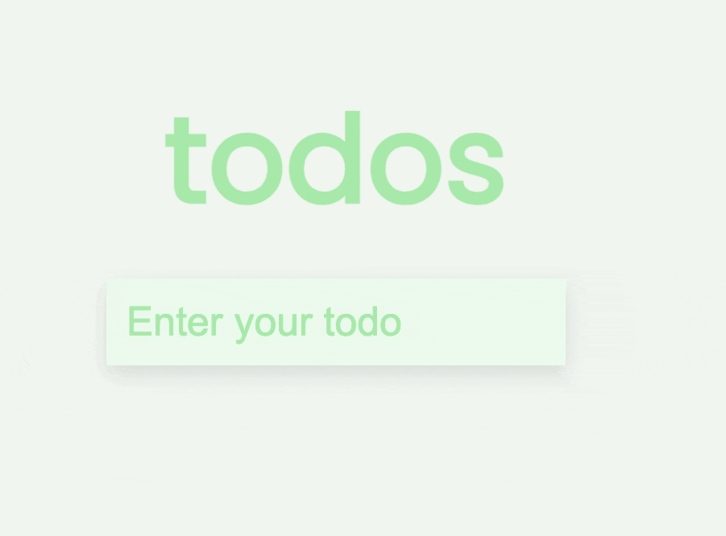
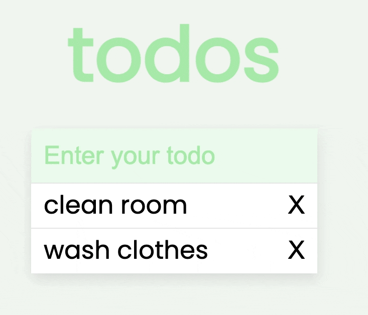
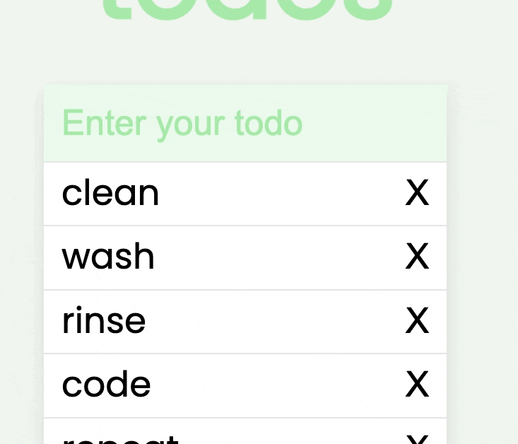

# Forms with Events Lab

Build one of the most common applications on the web, a simple todo application, with HTML, CSS, and JavaScript.

## Lab Setup

- Fork and clone this repository.
- Navigate to the settings tab on GitHub, then choose Pages from the menu. Configure the Build and Deployment to have a Source of "Deploy from a branch" and select the main branch for deployment. Deployments can take a few minutes, so get started on the lab, and then be sure to check the deployment after you have made a few commits.
- Open up the repository in VSCode. Follow the instructions below to complete the Lab.

## Instructions

You have only been provided with the HTML. You must create the CSS yourself using SASS and BEM. Here are the specs that should be in your project:

- A todo item should be added at the end of the list.
- Each item should be deletable.
- You should be able to strike through any complete tasks.
- A user should be able to type a large task into the form and see the entire task.
- The list should be visible on the viewable part of a user's screen. When the list starts to grow, it should become scrollable before reaching 200-300 px (this does not require media queries).

## Examples

### A todo item should be added at the end of the list.

### Each item should be deletable.

### You should be able to strike through any complete tasks.

### A user should be able to type a large task into the form and see the entire task.

### The list should be visible on the viewable part of a user's screen. When the list starts to grow, it should become scrollable before reaching 200-300 px (this does not require media queries).

## Submissions

Once you are done, submit your github pages link on canvas. 
